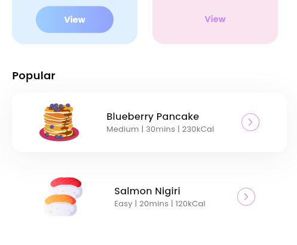

# 🏋️‍♀️ Fitness App: Home Page UI 🏋️‍♂️

Welcome to the **Fitness App**! This Flutter-based project creates a dynamic and interactive home page to guide users through categories, diets, and popular fitness plans.

---




## 📂 **File Structure**

```
📁 fitness_app/
├── 📂 assets/
│   └── 📂 icons/
│       ├── Arrow - Left 2.svg
│       ├── button.svg
│       ├── dots.svg
│       ├── Filter.svg
│       └── Search.svg
├── 📂 lib/
│   ├── 📂 models/
│   │   ├── category_model.dart
│   │   ├── diet_model.dart
│   │   └── popular_model.dart
│   └── home_page.dart
└── 📄 pubspec.yaml
```

---

## 🛠️ **Dependencies**

Ensure the following dependencies are added to your `pubspec.yaml`:

```yaml
dependencies:
  flutter:
    sdk: flutter
  flutter_svg: ^1.1.6 # Replace with the latest version
```

---

## 📋 **Code Overview**

### 🌟 **Main Components**

1. **`HomePage` Widget:**  
   Stateful widget managing UI components for displaying categories, diet recommendations, and popular diets.

2. **Model Integration:**  
   Utilizes `CategoryModel`, `DietModel`, and `PopularDietsModel` to dynamically generate content.

3. **Search and Filtering:**  
   Custom search field with SVG icons and filtering options for ease of use.

---

### 🖥️ **Widgets & Functions**

| **Function**           | **Description**                                              |
| ---------------------- | ------------------------------------------------------------ |
| `appBar()`             | Builds a custom AppBar with a back button and settings icon. |
| `_searchField()`       | Provides a search bar with filter functionality.             |
| `_categoriesSection()` | Displays a horizontal list of fitness categories.            |
| `_dietSection()`       | Shows recommended diets with interactive views.              |
| `_popularSection()`    | Lists popular diets with details and action buttons.         |

---

### 📦 **Models Used**

1. **CategoryModel**: Defines fitness categories.
2. **DietModel**: Contains data for recommended diets.
3. **PopularDietsModel**: Holds information on popular diet plans.

---

## 🎨 **UI Highlights**

- **Modular Design**: Each section is self-contained and reusable.
- **Beautiful Icons**: Utilizes `flutter_svg` for scalable, high-quality SVG icons.
- **Smooth Scrolling**: Horizontal and vertical lists with padding and separators for better readability.

---

## 🚀 **Running the Project**

1. Clone the repository:

   ```bash
   git clone https://github.com/Birkity/Flutter-Fitness.git
   cd fitness_app
   ```

2. Install dependencies:

   ```bash
   flutter pub get
   ```

3. Run the app:
   ```bash
   flutter run
   ```

---

📝 **Feel free to contribute, raise issues, or suggest enhancements!**  
Happy coding! 💻✨
